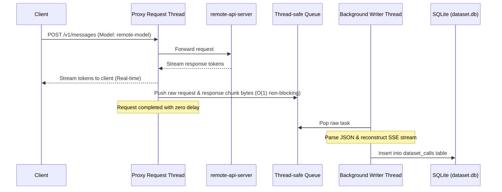

# Zero-Latency Session History Logging in Local Proxy

We have optimized the background request logging in the local proxy ([anthropic_proxy.py](file:///home/sergiom/Code/llms/localagent/anthropic_proxy.py)) to ensure **absolutely zero performance overhead** on the request path. All JSON parsing, decoding, stream reconstruction, and database writes are offloaded to a dedicated background daemon worker.

> [!NOTE]
> This logging only captures queries and responses directed to **remote cloud models** (such as remote assistant models sent via passthrough). Local model calls (e.g., to `local-llama` routing to `llama-server`) are completely ignored to keep the session logs clean.

## Optimization Architecture



### 1. Zero-Blocking Request Pathway
* For **passthrough streaming**, the proxy thread reads lines from the upstream socket and writes them directly to the client socket. It only appends the raw byte lines to a list (`O(1)` append).
* For **passthrough synchronous** calls, the proxy reads the raw response bytes and writes them to the client.
* As soon as the connection terminates, the raw byte list/payload is pushed onto a thread-safe `queue.Queue` using a non-blocking `put_nowait()` call.
* No text decoding, JSON parsing, regular expressions, or disk I/O are performed on the main request processing thread.

### 2. Parallel Processing Worker
A background daemon thread (`_dataset_writer_thread`) retrieves the tasks from the queue and handles the computationally expensive operations:
* JSON decoding of requests and responses.
* Parsing and reconstructing the SSE token stream to build complete content blocks (including tool uses and text).
* Injecting timestamps, formatting the log entries, and writing them to the SQLite database.

---

## Configuration

You can configure the dataset storage path using the `LLAMA_PROXY_DATASET` environment variable.

### Storage Location Resolution:
1. **Explicit**: If `LLAMA_PROXY_DATASET` is set, it will use that absolute file path (replacing `.jsonl` with `.db` automatically for database storage).
2. **Adjacent to Logs**: If not explicitly configured and `LLAMA_PROXY_LOG` is defined, it will place `dataset.db` in the same directory as the proxy log.
3. **Default**: Defaults to `~/.local/state/localagent/dataset.db`.

---

## SQLite Database Schema (`dataset_calls`)

The database logs are written to the `dataset_calls` table with the following schema:

```sql
CREATE TABLE dataset_calls (
    id INTEGER PRIMARY KEY AUTOINCREMENT,
    timestamp TEXT NOT NULL,       -- ISO UTC Timestamp
    model TEXT NOT NULL,           -- Model name (e.g., remote-model)
    system TEXT,                   -- System prompt (flattened)
    messages TEXT NOT NULL,        -- JSON string of raw messages list
    messages_flat TEXT NOT NULL,   -- JSON string of flattened messages
    conversations TEXT NOT NULL,   -- JSON string of ShareGPT conversations
    tools TEXT                     -- JSON string of tools list schema
);
```

---

## Exporting Logged Conversations

To prepare the session logs for export, use the `localagent export` tool:

```bash
# Export all logged queries in ShareGPT format to a file:
localagent export -o my_dataset.json

# Export the 10 most recent agentic turns that used tools:
localagent export --latest 10 --has-tools -o latest_tool_runs.json

# Stream raw JSONL directly to stdout (piped to jq):
localagent export --format jsonl --latest 5 2>/dev/null | jq '.conversations'
```

### Exporter Command Options:
* `--format` / `-f`: Export format (`sharegpt`, `openai`, `jsonl`).
* `--output` / `-o`: Output file path. If omitted, prints the JSON dataset directly to `stdout` and logs/snippets to `stderr`.
* `--min-turns N`: Filters out conversations with fewer than N non-system messages.
* `--has-tools`: Filters out non-agentic runs, exporting only sessions that called tools.
* `--latest N`: Exports only the N most recent conversations.

### Loading in Python:
If you exported in `sharegpt` format:
```python
from datasets import load_dataset

# 1. Load the exported dataset
dataset = load_dataset("json", data_files="my_dataset.json")

# 2. Access conversations
for entry in dataset["train"]:
    conversations = entry["conversations"]
    for msg in conversations:
        print(f"[{msg['from']}] {msg['value'][:100]}...")
```
