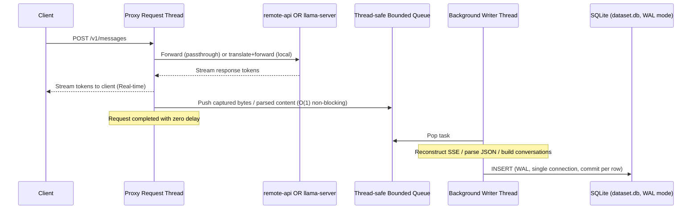

# Zero-Latency Session History Logging in Local Proxy

We have optimized the background request logging in the local proxy (`localagent/proxy.py`) to ensure **absolutely zero performance overhead** on the request path. All JSON parsing, decoding, stream reconstruction, and database writes are offloaded to a dedicated background daemon worker.

> [!NOTE]
> Both **local** and **remote** model calls are logged. The local model's
> prompts and answers are exactly the data needed to fine-tune/distill the
> local model, so they are now captured alongside the remote (Opus) calls.
> Use the existing `LLAMA_DISABLE_THINKING` knob to keep or strip the
> model's reasoning content.

## Optimization Architecture



### 1. Zero-Blocking Request Pathway
* For **passthrough streaming**, the proxy thread reads lines from the upstream socket and writes them directly to the client socket. It only appends the raw byte lines to an `io.BytesIO` (`O(1)` append).
* For **passthrough synchronous** calls, the proxy reads the raw response bytes and writes them to the client.
* For **local-model** calls, the proxy already builds the cleaned Anthropic content blocks in-process (for tool-call salvage); it re-uses the same `response_content` list to enqueue a `parsed` task — no second pass over the bytes.
* The captured payload is pushed onto a thread-safe bounded `queue.Queue` via a helper that drops the oldest pending task on overflow (so memory is bounded; the dropped count is reported periodically).
* No text decoding, JSON parsing, regular expressions, or disk I/O are performed on the main request processing thread.

### 2. Parallel Processing Worker
A background daemon thread (`_dataset_writer_thread`) is started by `main()` (not at import time) and handles the computationally expensive operations:
* JSON decoding of requests and responses.
* Parsing and reconstructing the SSE token stream to build complete content blocks (including tool uses and text).
* Injecting timestamps, formatting the log entries, and writing them to SQLite.
* The writer uses a single connection with `journal_mode=WAL`, `synchronous=NORMAL`, and `busy_timeout=10000` so the proxy stays responsive even while exports read the same DB concurrently.
* Each row is committed individually, so external readers (the exporter, `localagent info`, third-party tools) see new rows immediately without waiting on a batch flush.

---

## Configuration

You can configure the dataset storage path using the `LLAMA_PROXY_DATASET` environment variable.

### Storage Location Resolution:
1. **Explicit**: If `LLAMA_PROXY_DATASET` is set, it will use that absolute file path (replacing `.jsonl` with `.db` automatically for database storage).
2. **Adjacent to Logs**: If not explicitly configured and `LLAMA_PROXY_LOG` is defined, it will place `dataset.db` in the same directory as the proxy log.
3. **Default**: Defaults to `~/.local/state/localagent/dataset.db`.

### Other knobs:
* `LLAMA_PROXY_DATASET_QUEUE_MAX` — bounded queue size for the writer (default 10000). When full, the oldest task is dropped and counted.
* `LLAMA_PROXY_DATASET_ROTATE_MB` — if the DB exceeds this size at startup, it is renamed to `dataset.<UTC-timestamp>.db` and a fresh one is created. No rotation occurs during runtime.

---

## SQLite Database Schema (`dataset_calls`)

The database logs are written to the `dataset_calls` table:

```sql
CREATE TABLE dataset_calls (
    id INTEGER PRIMARY KEY AUTOINCREMENT,
    timestamp TEXT NOT NULL,            -- ISO UTC Timestamp
    model TEXT NOT NULL,                -- Model name (e.g. claude-opus, local-llama)
    system TEXT,                        -- System prompt (flattened)
    messages TEXT NOT NULL,             -- JSON: original Anthropic messages + assistant turn
    messages_flat TEXT NOT NULL,        -- JSON: flat-text variant (OpenAI-style)
    conversations TEXT NOT NULL,        -- JSON: ShareGPT-style {from, value} turns
    tools TEXT,                         -- JSON list of tool schemas (NULL when no tools)
    has_tool_calls INTEGER NOT NULL DEFAULT 0  -- 0/1, indexed for fast filtering
);
```

Legacy tables created before `has_tool_calls` was added are upgraded in place via
`ALTER TABLE ... ADD COLUMN` on the first writer start; the migration is
idempotent.

The `has_tool_calls` column is what the exporter's `--has-tools` flag uses
(it pushes the filter into SQL), and what trainer scripts can rely on to
select only agentic turns without re-parsing JSON.

---

## Exporting Logged Conversations

Use the `localagent export` tool to prepare the session logs for training:

```bash
# Export everything logged so far in ShareGPT format:
localagent export -o my_dataset.json

# Export the 10 most recent agentic turns that used tools:
localagent export --latest 10 --has-tools -o latest_tool_runs.json

# Stream raw JSONL to stdout (piped to jq):
localagent export --format jsonl --latest 5 2>/dev/null | jq '.conversations'
```

### Unsloth `train_on_responses_only` pitfall

When loading exported data into Unsloth with `train_on_responses_only=True`, Unsloth tokenizes the **full** conversation to locate where the response starts. If the full sequence exceeds `max_seq_length` (default 4096), the sample is silently dropped. With long agentic conversations (many tool calls, long contexts), this drops 100% of samples.

**Fix: set `max_seq_length` to match your model's context window.**

For models with 128k context (Claude, Llama-3-70b, etc.), set `max_seq_length=131072` in your Unsloth config. For 64k models, use 65536. Don't filter at export time — the data is what you need.

```bash
# In your Unsloth training config:
max_seq_length = 131072  # or match your model's actual context

# The exporter --max-length flag is only useful if you intentionally
# want to cap the data, not as a workaround for a too-small config.
```

**Common context sizes:**
- 8k → 8192
- 32k → 32768
- 64k → 65536
- 128k → 131072

### Exporter Command Options
* `--format` / `-f`: Export format — `sharegpt`, `openai`, or `jsonl`.
* `--output` / `-o`: Output file path. If omitted, prints the JSON dataset directly to `stdout` and logs/snippets to `stderr`.
* `--min-turns N`: Filters out conversations with fewer than N non-system messages.
* `--has-tools`: Filters out non-agentic runs, exporting only sessions that called tools. Filter is `WHERE has_tool_calls = 1` in SQL.
* `--latest N`: Exports only the N most recent conversations.
* `--model NAME`: Restrict to a specific model id.
* `--max-length N`: Drop conversations whose total serialized size exceeds N characters. Use this to avoid Unsloth dropping samples when `train_on_responses_only=True` and `max_seq_length` is small (e.g. 4096). Character count is a rough proxy for tokens.
* `--max-char-response N`: Drop conversations where any assistant response exceeds N characters. More targeted — only filters by response length.

---

## HuggingFace `datasets` compatibility

All three export formats are loadable with `load_dataset("json", data_files=...)` out of the box:

```python
from datasets import load_dataset

# ShareGPT
sg = load_dataset("json", data_files="my_dataset.json")["train"]
# row['conversations'] is a list of {from, value}; from is one of:
#   "system", "human", "gpt", "function"  (function = tool result turn)

# OpenAI chat fine-tuning
oa = load_dataset("json", data_files="openai_dataset.json")["train"]
# row['messages'] is a list of {role, content}; role is "system" | "user"
# | "assistant". Tool calls are embedded in the assistant content as
# <tool_call>{...}</tool_call> / <tool_response>...</tool_response> markers.

# JSONL — preserves the raw Anthropic block structure under row['messages']
# and the flattened forms under row['messages_flat'] / row['conversations'].
jl = load_dataset("json", data_files="raw.jsonl")["train"]
```

Tool calls appear in the `gpt` content as `<tool_call>`/`</tool_call>`
markers (this is the format most open-source fine-tuning stacks — axolotl,
LLaMA-Factory — expect). Trainers that need strict OpenAI tool-call
semantics can post-process the `messages_flat` field to split out
`tool_calls` / `tool` role messages.

---

## JSONL migration

If a legacy `dataset.jsonl` is found next to the DB, it is imported on the
first writer start (NOT at import time, so the proxy can serve requests
while the import runs). The import is bounded: JSONL files larger than
256 MB are skipped with a warning rather than blocking startup. The
migration is idempotent (skipped if the DB already has rows).

---

## Tests

`localagent/test_proxy.py` is stdlib `unittest`. The
`TestExporterHFRoundTrip` class is skipped if `huggingface datasets` is
not installed; when installed, it seeds the writer, runs the exporter
for every format, and loads the output with `load_dataset` to confirm
schema and content are usable for training.
